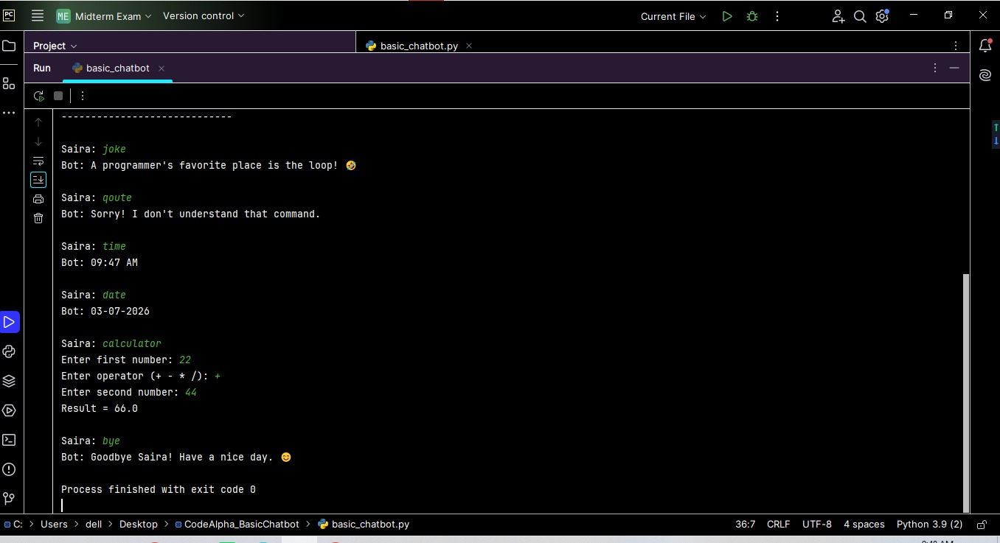

# CodeAlpha Basic Chatbot
## Live Project
👉 https://sairaijaz.pythonanywhere.com
## About the Project
This project was developed as part of the **CodeAlpha Python Programming Internship**.The Smart Chatbot started as a Python command-line application and has now been upgraded into a **Flask-based web application** with a simple and interactive user interface.It interacts with users through simple text commands. It can greet users, answer basic questions, display the current date and time, perform basic calculations, tell random jokes, and share motivational quotes.
## Features
- 👋 Greets the user
- 💬 Responds to basic questions
- 🕒 Displays the current time
- 📅 Displays today's date
- ➕ Built-in calculator
- 😂 Tells random jokes
- 💡 Shares motivational quotes
- 🌐 Web-based Flask interface (NEW)
- 🚪 Exit command to end the chat
- 😊 Easy-to-use interface
## Technologies Used
- Python 3
- Flask
- HTML
- CSS
- PyCharm IDE
- Random Module
- Datetime Module
## Project Structure
CodeAlpha_BasicChatbot/ │── app.py │── basic_chatbot.py │── templates/ │     └── index.html │── static/ │     └── style.css │── README.md
## How to Run Locally
1. Open the project in PyCharm.
2. Install Flask:
pip install flask
3. Run the Flask app:
python app.py
4. Open browser and go to:
http://127.0.0.1:5000/⁠�
## Project Screenshot

## Developed By
**Saira Ijaz**
## 📌 Note
This project was first built as a terminal-based chatbot and later upgraded into a Flask web application and deployed online using PythonAnywhere.
